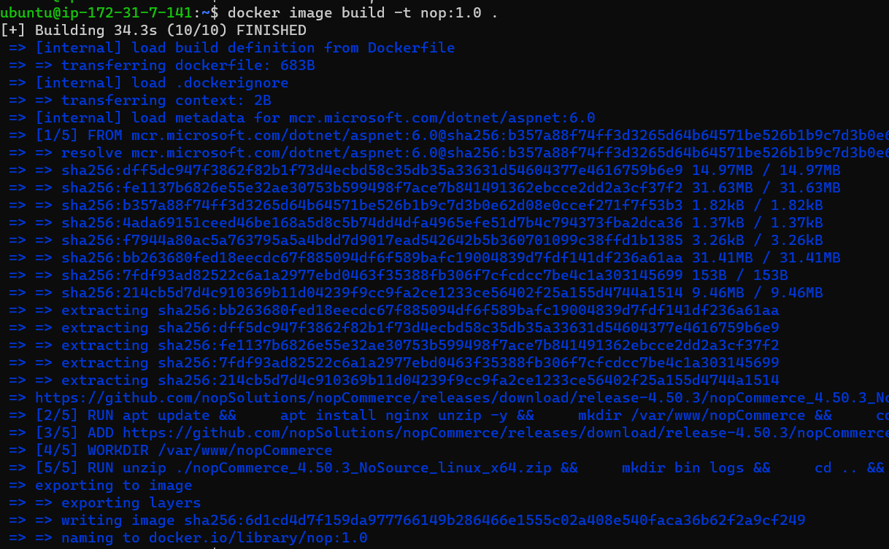

HOW TO INSTALL NOPCOMMERCE APPLICATION BUILD DOCKER IMAGE ON UBUNTU:
--------------------------------------------------------------------
 * Manual steps:
  -------------
```
wget https://packages.microsoft.com/config/ubuntu/20.04/packages-microsoft-prod.deb -O packages-microsoft-prod.deb
sudo dpkg -i packages-microsoft-prod.deb
sudo apt-get update
sudo apt-get install -y apt-transport-https aspnetcore-runtime-6.0
dotnet --list-runtimes
sudo apt-get install nginx
sudo systemctl start nginx
sudo systemctl status nginx
vi /etc/nginx/sites-available/default
  ```
  # Default server configuration
  #
  server {
      listen 80 default_server;
      listen [::]:80 default_server;

      server_name   nopCommerce.com;

      location / {
      proxy_pass         http://localhost:5000;
      proxy_http_version 1.1;
      proxy_set_header   Upgrade $http_upgrade;
      proxy_set_header   Connection keep-alive;
      proxy_set_header   Host $host;
      proxy_cache_bypass $http_upgrade;
      proxy_set_header   X-Forwarded-For $proxy_add_x_forwarded_for;
      proxy_set_header   X-Forwarded-Proto $scheme;
      }

      # SSL configuration
      #
      # listen 443 ssl default_server;
      # listen [::]:443 ssl default_server;
      #
      # Note: You should disable gzip for SSL traffic.
      # See: https://bugs.debian.org/773332
      #
      # Read up on ssl_ciphers to ensure a secure configuration.
      # See: https://bugs.debian.org/765782
      #
      # Self signed certs generated by the ssl-cert package
      # Don't use them in a production server!
      #
      # include snippets/snakeoil.conf;
  }
  ```
mkdir /var/www/nopCommerce
cd /var/www/nopCommerce
sudo wget https://github.com/nopSolutions/nopCommerce/releases/download/release-4.50.3/nopCommerce_4.60.2_NoSource_linux_x64.zip
sudo apt-get install unzip
sudo unzip nopCommerce_4.50.3_NoSource_linux_x64.zip
sudo mkdir bin
sudo mkdir logs
cd ..
sudo chgrp -R www-data nopCommerce/
sudo chown -R www-data nopCommerce/
vi /etc/systemd/system/nopCommerce.service
  ```
  [Unit]
  Description=Example nopCommerce app running on Xubuntu

  [Service]
  WorkingDirectory=/var/www/nopCommerce
  ExecStart=/usr/bin/dotnet /var/www/nopCommerce/Nop.Web.dll
  Restart=always
  # Restart service after 10 seconds if the dotnet service crashes:
  RestartSec=10
  KillSignal=SIGINT
  SyslogIdentifier=nopCommerce-example
  User=www-data
  Environment=ASPNETCORE_ENVIRONMENT=Production
  Environment=DOTNET_PRINT_TELEMETRY_MESSAGE=false

  [Install]
  WantedBy=multi-user.target
  ```
sudo systemctl start nopCommerce.service
sudo systemctl status nopCommerce.service

```
* process:
  --------
  * firstly created one ec2 instance and login to the machine through power shell
  * next install docker on ubuntu
  
  
  * write Dockerfile to this application
  ```
  FROM mcr.microsoft.com/dotnet/aspnet:6.0 as sweety
  RUN apt update && \
      apt install nginx unzip -y && \
      mkdir /var/www/nopCommerce && \
      cd /var/www/nopCommerce    
  ADD https://github.com/nopSolutions/nopCommerce/releases/download/release-4.50.3/nopCommerce_4.50.3_NoSource_linux_x64.zip /var/www/nopCommerce 
  WORKDIR /var/www/nopCommerce 
  RUN unzip ./nopCommerce_4.50.3_NoSource_linux_x64.zip && \
      mkdir bin logs && \
      cd .. && \
      chgrp -R www-data nopCommerce/* && \
      chmod -R 777 nopCommerce/* && \
      chown -R www-data nopCommerce/*
  EXPOSE 80 
  CMD ["dotnet", "Nop.Web.dll", "run", "--server.urls=http://0.0.0.0:*"] 

  ```
  
   
  * Build the image using this Dockerfile
   
  * Create container using this build image
  
  * goto browser give the publicip:application port number hit enter and open our springpetclinic application
   

        

       

