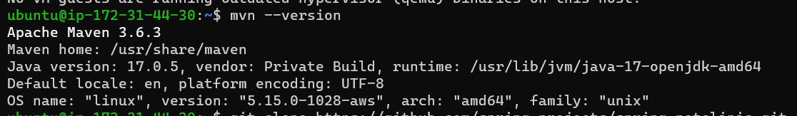

HOW TO INSTALL SPRING-PETCLINIC ON UBUNTU:
------------------------------------------
* Manual steps:
  -------------
```
sudo apt update
sudo apt install -y openjdk-17-jdk
java --version
sudo apt install maven
mvn --version
git clone https://github.com/spring-projects/spring-petclinic.git
cd spring-petclinic
./mvnw package
java -jar target/*.jar

```
* process:
  --------
  * firstly created one ec2 instance and login to the machine through power shell
  * next execute the commands one by one
  
  
  
  
  
  
  
  
  
  * goto browser give the publicip:application port number hit enter and opened our springpetclinic application
  
  
  
  